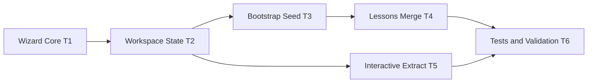

# OpenLoom Agentic OpenClaw 对齐实施任务单 v1

## 1. 目标与边界

本任务单用于把 OpenLoom 中所有 Agentic agent 相关能力，对齐到 OpenClaw 风格实现逻辑：

- Wizard 驱动（统一交互抽象）
- Workspace bootstrap 记忆文件体系
- 独立 onboarding 状态文件
- 增量记忆合并（非整文件覆盖）
- 交互式提取与 onboarding 共用状态机

非目标（本轮不做）：

- 不改现有 metadata 文件格式（`.openloom/metadata/*`）
- 不引入数据库迁移
- 不在本轮做 UI 全量重构（先 CLI 跑通）

---

## 2. 里程碑规划

## M1：Wizard 与状态骨架落地（优先级 P0）

目标：把 onboarding 从“命令式问答”升级为“wizard 状态机”。

### 2.1 新增/改造文件

- 新增 `src/wizard/prompts.ts`
- 新增 `src/wizard/session.ts`
- 新增 `src/wizard/onboarding.ts`
- 新增 `src/config/workspace-state.ts`
- 改造 `src/cli/commands/setup.ts`
- 轻改 `src/cli/commands/extract.ts`（复用 onboarding 入口）

### 2.2 实施任务

- 定义 `WizardPrompter` 抽象（note/select/text/confirm/progress）。
- 增加 `WizardSession`（next/answer/cancel）以支持 CLI 与未来 UI 复用。
- setup 改为调用 `runOnboardingWizard()`。
- 新增 `workspace-state.json` 读写工具：
  - `bootstrapSeededAt`
  - `onboardingCompletedAt`
  - `lastWizardRunAt`
  - `lastWizardSource`
- 未完成 onboarding 时，`extract --interactive` 自动引导到 onboarding。

### 2.3 验收标准

- `openloom setup` 可在 wizard 里完整走完并成功退出。
- 再次执行 setup 时可识别已有状态并走“更新路径”。
- `extract --interactive` 在未完成 onboarding 时自动转 setup，不中断流程。

### 2.4 回滚策略

- 保留旧 `setup` 入口函数（以 feature flag 或保留 fallback 分支）。
- `workspace-state` 读取失败时降级为“未完成 onboarding”而非崩溃。

---

## M2：Bootstrap 记忆文件体系（优先级 P0）

目标：引入 OpenClaw 风格的记忆模板文件，并建立首次 seed 流程。

### 3.1 新增/改造文件

- 新增 `src/config/agent-memory/bootstrap-templates.ts`
- 新增 `src/config/agent-memory/bootstrap-files.ts`
- 新增 `.openloom/agent/templates/BOOTSTRAP.md`（运行时模板来源可放代码常量）
- 新增 `.openloom/agent/templates/IDENTITY.md`
- 新增 `.openloom/agent/templates/USER.md`
- 新增 `.openloom/agent/templates/SOUL.md`
- 改造 `src/config/lessons-memory.ts`

### 3.2 实施任务

- 实现 `ensureAgentBootstrapFiles(openloomDir)`：
  - 若文件不存在则 seed
  - 若存在则不覆盖
- 首轮 onboarding 问答结果同步写入：
  - `IDENTITY.md`
  - `USER.md`
  - `SOUL.md`
  - `lessons.md`
- 增加 `BOOTSTRAP.md` 生命周期策略：
  - MVP：完成后保留并写入 completed 标记（先不删除）

### 3.3 验收标准

- 首次 setup 后 5 个文件均存在。
- 重复 setup 不会覆盖用户手工编辑的非目标字段。
- `lessons.md` 与 `USER/IDENTITY/SOUL` 内容一致性可核对。

### 3.4 回滚策略

- seed 只用 `write-if-missing`，确保回滚仅需删除新建文件。
- 若同步写入多文件失败，记录错误并至少保证 `lessons.md` 可用。

---

## M3：非覆盖记忆合并策略（优先级 P0）

目标：把 `lessons.md` 从整文件覆盖改为字段级合并。

### 4.1 新增/改造文件

- 新增 `src/config/agent-memory/lessons-parser.ts`
- 新增 `src/config/agent-memory/lessons-merge.ts`
- 改造 `src/config/lessons-memory.ts`
- 新增测试 `src/config/agent-memory/*.test.ts`

### 4.2 实施任务

- 实现 `parseLessons(content)`：
  - 分节解析 `UserProfile/CommunicationStyle/WorkingAgreements/UpdateLog`
- 实现 `mergeLessons(existing, incoming)`：
  - `skip/empty` 不覆盖已有值
  - `pending` 仅在缺失时补位
  - `WorkingAgreements` 去重并集
  - `UpdateLog` 仅 append
- 实现原子写：
  - `write tmp -> rename`

### 4.3 验收标准

- 连续两次 setup，第二次仅改一项时其余字段不丢失。
- 用户手工改动后再执行 setup，不会被整文件覆盖。
- 并发写失败时不会产生损坏文件。

### 4.4 回滚策略

- 解析失败 fallback：备份原文件后重建并记录 `parse_recovered` 日志。
- 保留旧写入函数作为紧急兜底（仅 debug 用）。

---

## M4：Root 与交互提取统一到 Wizard（优先级 P1）

目标：`roots` 与 `extract --interactive` 共用 wizard 交互语义。

### 5.1 新增/改造文件

- 改造 `src/cli/commands/roots.ts`
- 改造 `src/cli/commands/extract.ts`
- 新增 `src/wizard/extract-interactive.ts`

### 5.2 实施任务

- `extract --interactive` 使用 wizard prompter，不再直接 readline 拼接。
- root 读取逻辑统一经过 `workspace-state + user-settings`。
- 支持“保存本次提取偏好为默认值”。

### 5.3 验收标准

- 交互提取文案一致、支持 skip/默认值回显。
- 非交互 `extract` 行为保持兼容。

### 5.4 回滚策略

- 保留非交互参数路径不变，interactive 分支可独立关闭。

---

## M5：Skills 对齐与契约化（优先级 P1）

目标：将 3 个编排型 skill 与实际 wizard/state 实现对齐。

### 6.1 新增/改造文件

- 改造 `skills/bootstrap-cold-start/SKILL.md` + `scripts/run.js`
- 改造 `skills/root-dir-manager/SKILL.md` + `scripts/run.js`
- 改造 `skills/interactive-extract/SKILL.md` + `scripts/run.js`

### 6.2 实施任务

- 将脚本从占位输出改为真实调用 CLI/模块。
- 明确 JSON contract（输入/输出/错误码）。
- 在 SKILL.md 中写清触发场景和失败处理。

### 6.3 验收标准

- 三个 skill 均可输出稳定 JSON，字段与 CLI 结果一致。
- 错误路径可预测（缺配置、路径不存在、权限错误）。

### 6.4 回滚策略

- 若 skill 执行失败，CLI 仍可直接使用，skill 仅作为编排层。

---

## M6：测试与发布门禁（优先级 P0）

目标：确保对齐改造不引入回归。

### 7.1 自动化测试任务

- 新增 `wizard` 单测：
  - session 生命周期
  - cancel/confirm/select 行为
- 新增 `workspace-state` 单测
- 新增 `bootstrap-files` 单测（write-if-missing）
- 新增 `lessons merge` 单测（非覆盖）
- 扩展 CLI 集成测试：
  - 首次 setup 产物
  - 重复 setup 合并行为
  - extract 自动 onboarding

### 7.2 手动验收任务（Windows 优先）

- 对话体验（文案、默认值、skip）
- 产物完整性（5 个 agent 记忆文件 + 2 个状态配置文件）
- 兼容性（非交互提取、历史 metadata）

### 7.3 回滚策略

- 每个里程碑独立 PR，支持逐里程碑回退。
- 引入 feature flags：
  - `OPENLOOM_WIZARD_ENABLED`
  - `OPENLOOM_LESSONS_MERGE_V2`

---

## 3. TODO 列表（可直接执行）

## P0（必须）

- [x] T1: 建立 `src/wizard` 抽象并接管 `setup`
- [x] T2: 引入 `workspace-state.json` 与完成判定
- [x] T3: 引入 bootstrap 文件 seed（BOOTSTRAP/IDENTITY/USER/SOUL）
- [x] T4: 实现 `lessons.md` 字段级 merge（非覆盖）
- [x] T5: `extract --interactive` 自动 onboarding 且不回归
- [x] T6: 补齐单测与集成测试，形成 CI 可跑最小集合

## P1（强烈建议）

- [x] T7: `extract --interactive` 全量迁移到 wizard prompter
- [x] T8: roots 命令交互语义统一（与 wizard 同风格）
- [x] T9: 三个 skill 从占位脚本升级为真实契约实现

## P2（后续优化）

- [x] T10: bootstrap 完成后的生命周期策略（归档/只读标记）
- [x] T11: Gateway/UI 端复用 WizardSession 协议（MVP：`wizard.start/next/answer/cancel`）
- [x] T12: 多输入源目录（source roots）与规则化 include/exclude 策略

---

## 4. 建议实施顺序（两周版本）

- Week 1: T1-T4（核心架构与记忆合并）
- Week 2: T5-T9（交互提取、skills、测试收敛）

建议以 4 个小 PR 推进：

1. `wizard + workspace-state`
2. `bootstrap files + lessons merge`
3. `interactive extract alignment`
4. `skills + tests + docs`

---

## 5. Staff Engineer 级检查清单

- 逻辑是否从“命令堆叠”转为“统一状态机”？
- 记忆写入是否避免覆盖用户手工编辑内容？
- onboarding 是否具备可恢复、可重入特性？
- 是否保留非交互路径，避免影响自动化？
- 是否每个里程碑都能独立回滚？

### 最新验证记录（2026-04-24）

- 执行命令：`npm run dev -- extract --interactive data/fanyang --openloom .openloom`
- 验证结果：
  - 未完成 onboarding 时自动触发 setup
  - onboarding 完成后无中断继续 interactive extract
  - interactive 参数可保存到 `user-settings.json`
  - `data/fanyang` 样本提取成功（3/3）
  - Gateway 已支持 WizardSession 协议消息：`wizard.start`/`wizard.next`/`wizard.answer`/`wizard.cancel`
  - `dev-ui` 可通过输入 `/onboarding` 触发 onboarding wizard（MVP）
  - `user-settings.json` 已支持 `roots` 与 `scan_rules(include/exclude)`，兼容旧 `default_root`
  - CLI 已支持 `roots add/remove/list/set-default/clear` 与 `rules show/include-add/include-remove/exclude-add/exclude-remove/reset-default`
  - `extract` 与 `scan` 已支持 `--all-roots --include --exclude`，并统一采用 `exclude` 优先规则
  - Gateway `scan.start` 已支持 include/exclude 并与 CLI 规则语义一致
  - 实测（`.tmp/t12-openloom`）：`roots`/`rules` 命令可正常持久化，`extract --all-roots --include "**/*.docx"` 可命中并处理样本文件
  - 已修复：include 非空时目录被提前过滤导致 `extract` 返回 0 文件的问题
  - 已知阻塞（历史问题，非 T12 新引入）：`scan` 仍依赖 `src/ingestion/scanner/bridge.ts` 中硬编码的 macOS scanner binary 路径，Windows 环境会触发 `ENOENT`

---

## 6. P0 文件级实施拆解（可直接开工）

说明：

- 工时单位为“人时（h）”，按 1 名熟悉代码库工程师估算。
- `前置依赖` 中出现的任务必须先完成，才能开始当前任务。
- `可并行` 标记仅表示技术上可并发，不代表推荐立即并发。

| 任务ID | 文件级改动清单 | 前置依赖 | 预估工时 | 可并行 | 交付物 |
|---|---|---|---:|---|---|
| T1 | `src/wizard/prompts.ts`、`src/wizard/session.ts`、`src/wizard/onboarding.ts`、`src/cli/commands/setup.ts` | 无 | 8h | 否 | Wizard 抽象 + setup 接管 |
| T2 | `src/config/workspace-state.ts`、`src/cli/commands/setup.ts`、`src/cli/commands/extract.ts` | T1 | 4h | 否 | onboarding 状态判定与推进 |
| T3 | `src/config/agent-memory/bootstrap-templates.ts`、`src/config/agent-memory/bootstrap-files.ts`、`src/cli/commands/setup.ts` | T2 | 6h | 否 | bootstrap 文件 seed 与首次写入 |
| T4 | `src/config/agent-memory/lessons-parser.ts`、`src/config/agent-memory/lessons-merge.ts`、`src/config/lessons-memory.ts` | T3 | 7h | 否 | lessons 非覆盖 merge V2 |
| T5 | `src/cli/commands/extract.ts`、`src/wizard/extract-interactive.ts`、`src/config/user-settings.ts` | T2 | 5h | 是（与 T4 末段可并行） | interactive extract 自动 onboarding |
| T6 | `src/wizard/*.test.ts`、`src/config/*.test.ts`、`src/e2e/integration.test.ts`、`docs/冷启动交互验收清单.md` | T4、T5 | 8h | 否 | 自动化与手动验收闭环 |

P0 总工时估算：`38h`（约 `5` 个工作日，预留 20% 风险缓冲后约 `6` 个工作日）。

### 6.1 任务实施细化

#### T1: Wizard 抽象并接管 setup

实施步骤：

1. 在 `src/wizard/prompts.ts` 定义统一交互接口类型。
2. 在 `src/wizard/session.ts` 实现 `next/answer/cancel` 生命周期。
3. 在 `src/wizard/onboarding.ts` 编排首轮 onboarding 问答。
4. 将 `src/cli/commands/setup.ts` 的 readline 逻辑迁移为 wizard 调用。

完成定义（DoD）：

- setup 不再直接依赖命令层散装问答函数。
- wizard 支持后续复用到 `extract --interactive`。

#### T2: 引入 workspace-state 完成判定

实施步骤：

1. 新建 `src/config/workspace-state.ts`（读写 + 默认值 + 原子写）。
2. 在 setup 成功后写入 `onboardingCompletedAt`。
3. 在 extract 入口先读取状态，未完成则跳转 onboarding。

完成定义（DoD）：

- onboarding 完成判定不再依赖临时变量或日志输出。

#### T3: bootstrap 文件体系 seed

实施步骤：

1. 新建模板常量模块 `bootstrap-templates.ts`。
2. 新建 seed 模块 `bootstrap-files.ts`，实现 `write-if-missing`。
3. setup 中在 onboarding 前调用 `ensureAgentBootstrapFiles()`。
4. 首轮结果同步回写 `IDENTITY/USER/SOUL/lessons`。

完成定义（DoD）：

- 首次 setup 后，`BOOTSTRAP/IDENTITY/USER/SOUL/lessons` 全部存在。

#### T4: lessons 非覆盖合并

实施步骤：

1. 解析器：把 `lessons.md` 转换成结构化对象。
2. 合并器：实现字段优先级与 `UpdateLog` 追加策略。
3. 在 `lessons-memory.ts` 替换当前整文件覆盖写入。
4. 增加失败回退（备份 + 重建 + 恢复日志）。

完成定义（DoD）：

- `skip/empty` 不会覆盖已有值。
- 手工编辑内容在可识别分节内可保留。

#### T5: extract --interactive 自动 onboarding

实施步骤：

1. 在 `src/cli/commands/extract.ts` 统一调用 `ensureInitializedOrSetup()`（基于 workspace-state）。
2. 新建 `src/wizard/extract-interactive.ts` 承载提取问答逻辑。
3. 让 interactive 分支只消费 wizard 输出，不直接维护问答细节。

完成定义（DoD）：

- 未 onboarding 用户运行 interactive extract 时可自动进入 setup 并返回继续执行。

#### T6: 测试与验收闭环

实施步骤：

1. 为 wizard/session 增加生命周期测试。
2. 为 workspace-state、bootstrap seed、lessons merge 增加单测。
3. 扩展集成测试覆盖首次 setup、重复 setup、extract 自动 onboarding。
4. 更新手动验收清单并至少完成一次 Windows 本地走查。

完成定义（DoD）：

- P0 相关测试可稳定通过。
- 手动验收项有明确结果记录（通过/失败/阻塞）。

### 6.2 串并行执行图



### 6.3 PR 切分建议（P0 版本）

- PR1（基础架构）：
  - T1 + T2
- PR2（记忆体系）：
  - T3 + T4
- PR3（提取接入与验证）：
  - T5 + T6

每个 PR 均需包含：

- 改动说明
- 验收截图/日志
- 回滚说明

---

## 7. T12 命令行使用示例（可直接复制）

以下示例默认在仓库根目录执行，且 `.openloom` 使用默认路径。

### 7.1 配置多输入源目录（source roots）

```bash
npm run dev -- roots add "D:/data/work"
npm run dev -- roots add "D:/data/personal"
npm run dev -- roots set-default "D:/data/work"
npm run dev -- roots list
```

预期：
- `roots list` 可看到多个 source roots；
- 默认 root 带 `(default)` 标记。

### 7.2 配置 include/exclude 规则

```bash
npm run dev -- rules show
npm run dev -- rules include-add "**/*.md"
npm run dev -- rules include-add "**/*.png"
npm run dev -- rules exclude-add "**/.cache/**"
npm run dev -- rules exclude-add "**/node_modules/**"
npm run dev -- rules show
```

预期：
- `rules show` 中 include/exclude 规则已更新；
- 规则语义为 `exclude` 优先于 `include`。

### 7.3 extract：单路径 + 多 roots

```bash
# 单路径提取（显式传入）
npm run dev -- extract "D:/data/work" --include "**/*.md" --exclude "**/.git/**"

# 从全部 source roots 提取
npm run dev -- extract --all-roots
```

预期：
- 单路径模式仅处理传入路径；
- `--all-roots` 模式遍历已配置全部 source roots；
- include/exclude 行为与 rules 配置一致。

### 7.4 scan：单路径 + 多 roots

```bash
# 单路径扫描
npm run dev -- scan "D:/data/work" --include "**/*.md" --exclude "**/dist/**"

# 扫描全部 source roots
npm run dev -- scan --all-roots
```

预期：
- `scan` 支持与 `extract` 同语义规则参数；
- 未传路径时可通过默认 root 或 `--all-roots` 执行。

### 7.5 恢复默认规则

```bash
npm run dev -- rules reset-default
npm run dev -- rules show
```

预期：
- include 为空；
- exclude 恢复为系统默认安全排除项。
