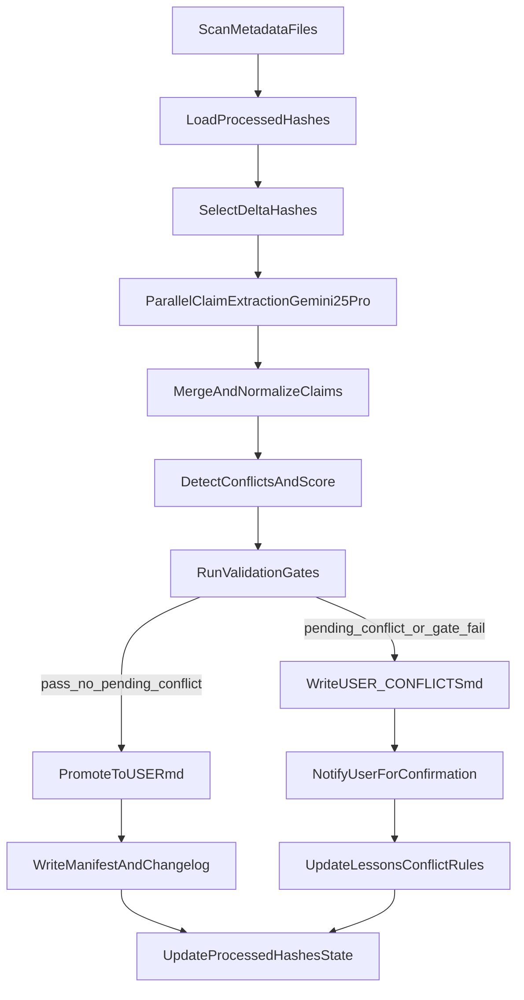

# 基于 metadata 的用户画像抽取实施方案 v1

## 1. 背景与目标

本方案用于在 OpenLoom 中实现“基于 `.openloom/metadata` 的用户画像抽取”，并满足以下关键要求：

- 使用 LLM（`gemini-2.5-pro`）进行画像事实推理与结构化输出。
- 并行处理全部 metadata，但跳过已处理过的证据。
- 在更新 `USER.md` 前执行证据级可信性校验。
- 对冲突信息给出多候选置信度，不直接覆盖为单一事实。
- 将冲突沉淀到待确认文档，后续与用户交互确认。
- 将确认结果与冲突处理规则写入 `lessons.md`，后续遇到同类冲突时默认不自动更新 `USER.md`，只提醒用户。

---

## 2. 总体设计原则

1. **证据优先**：`USER.md` 只能由证据驱动更新，不能由单次模型猜测直接写入。
2. **先候选后发布**：先生成候选画像，再做校验，最后才发布到 `USER.md`。
3. **冲突可见**：冲突不丢弃，必须结构化记录并等待确认。
4. **可回滚可审计**：每次发布必须可追溯到 evidence hash 集合和版本记录。
5. **增量幂等**：同一批证据重复执行不应产生重复事件或漂移结果。

---

## 3. 目标产物与文件布局

在现有文件基础上新增/使用以下产物：

- 已有主画像：`.openloom/agent/USER.md`
- 已有版本与变更：
  - `.openloom/agent/USER_VERSION_MANIFEST.json`
  - `.openloom/agent/USER_CHANGELOG.md`
- 新增待确认冲突池（建议）：
  - `.openloom/agent/USER_CONFLICTS.md`
- 新增处理进度状态（建议）：
  - `.openloom/agent/profile-extract-state.json`

其中：

- `USER.md`：仅存“已发布且通过校验”的事实。
- `USER_CONFLICTS.md`：存“候选冲突事实 + 置信度 + 证据列表 + 待用户确认状态”。
- `profile-extract-state.json`：存“哪些 metadata hash 已被画像流程消费”，用于跳过已处理文件。

---

## 4. 并行增量处理方案（跳过已处理）

### 4.1 输入集合

- 扫描 `.openloom/metadata/text_docs/*.md` 与 `.openloom/metadata/images/*.md`
- 为每个 metadata 文件提取唯一键：`hash`

### 4.2 跳过策略

- 从 `profile-extract-state.json` 读取 `processed_hashes`
- 对 `hash` 已存在且 metadata 未变化（同 hash）者直接跳过
- 对新 hash 或强制重算 hash 才进入本轮候选生成

### 4.3 并行策略

- 使用受限并行池（例如 `N=5~10`，可配置）
- 每个 worker 独立处理一个 metadata -> claim 集合
- 汇总阶段统一执行去重、合并、冲突检测与评分

说明：现有 ingestion 已有 hash-skip 能力（元数据抽取阶段），本方案是“画像阶段”的二次增量跳过。

---

## 5. LLM 推理与结构化输出设计（gemini-2.5-pro）

### 5.1 两阶段 LLM 流程

1. **Claim Extraction（并行）**
   - 输入：单个 metadata 的 frontmatter + summary
   - 输出：标准化 claim 列表（字段化）
2. **Conflict Resolution（汇总）**
   - 输入：全量 claim（仅本轮增量 + 历史关键事实）
   - 输出：
     - 主候选事实（含置信度）
     - 冲突候选事实（含置信度分布）
     - 推荐动作（auto_accept / requires_user_confirmation / reject）

### 5.2 StructuredOutput 定义（BaseModel）

为保证工程可实现性，第 1 阶段与第 2 阶段分别定义一个 `BaseModel` 输出。

```python
from typing import List, Optional, Literal
from pydantic import BaseModel, Field


class TimeWindow(BaseModel):
    time_start: Optional[str] = Field(default=None, description="ISO-like time start, e.g. 2024-08 or 2024-08-01")
    time_end: Optional[str] = Field(default=None, description="ISO-like time end")
    time_text: str = Field(description="Original period text from evidence")
    precision: Literal["day", "month", "year", "range", "unknown"] = "unknown"


class LocationInfo(BaseModel):
    city: Optional[str] = None
    province_or_state: Optional[str] = None
    country: Optional[str] = None
    raw_text: Optional[str] = None


class ClaimCandidate(BaseModel):
    fact_key: str = Field(description="Canonical fact key, e.g. birthplace, study_phd, work_microsoft_2021_2024")
    event_type: Literal["identity", "education", "work", "family", "legal", "residence", "travel"]
    value: str = Field(description="Normalized fact statement")
    time: TimeWindow
    location: LocationInfo
    evidence_hashes: List[str] = Field(default_factory=list)
    evidence_refs: List[str] = Field(default_factory=list)
    model_confidence: float = Field(ge=0, le=1)
    source_reliability_score: float = Field(ge=0, le=1)
    final_confidence: float = Field(ge=0, le=1)
    status: Literal["candidate", "accepted", "conflict_pending"] = "candidate"
    reasoning: str = Field(description="Short justification for scoring and normalization")


class ClaimExtractionOutput(BaseModel):
    metadata_hash: str
    model: Literal["gemini-2.5-pro"] = "gemini-2.5-pro"
    claims: List[ClaimCandidate] = Field(default_factory=list)
    extraction_notes: List[str] = Field(default_factory=list)
```

```python
from typing import List, Optional, Literal
from pydantic import BaseModel, Field


class ConflictCandidate(BaseModel):
    value: str
    confidence: float = Field(ge=0, le=1)
    evidence_hashes: List[str] = Field(default_factory=list)
    evidence_refs: List[str] = Field(default_factory=list)
    reason: str


class ConflictItem(BaseModel):
    conflict_id: str
    fact_key: str
    candidates: List[ConflictCandidate] = Field(default_factory=list)
    recommended_value: Optional[str] = None
    recommended_confidence: Optional[float] = Field(default=None, ge=0, le=1)
    decision: Literal["auto_accept", "requires_user_confirmation", "reject"] = "requires_user_confirmation"
    freeze_user_update: bool = True
    lessons_rule_suggested: Optional[str] = None


class ResolvedFact(BaseModel):
    fact_key: str
    value: str
    final_confidence: float = Field(ge=0, le=1)
    evidence_hashes: List[str] = Field(default_factory=list)
    evidence_refs: List[str] = Field(default_factory=list)
    update_allowed: bool = True


class ConflictResolutionOutput(BaseModel):
    model: Literal["gemini-2.5-pro"] = "gemini-2.5-pro"
    resolved_facts: List[ResolvedFact] = Field(default_factory=list)
    conflicts: List[ConflictItem] = Field(default_factory=list)
    global_decision: Literal["promote", "promote_with_pending_conflicts", "hold"] = "hold"
    summary: str
```

### 5.3 字段约束与落地规则

- `ClaimExtractionOutput` 仅面向“单 metadata 输入”的并行 worker。
- `ConflictResolutionOutput` 仅面向“全量 claim 汇总”阶段，作为发布前 Gate 的直接输入。
- 若 `ConflictItem.decision = requires_user_confirmation`，则：
  - 对应事实不得覆盖 `USER.md`；
  - 必须写入 `USER_CONFLICTS.md`；
  - 必须生成可写入 `lessons.md` 的规则建议。
- `model` 固定为 `gemini-2.5-pro`，便于审计模型来源与复现实验。

---

## 6. 发布前证据校验（Gate）

在写入 `USER.md` 前，必须全部通过：

1. **Coverage Gate**
   - 本轮待处理 metadata 是否全部被消费（无遗漏 hash）
2. **Traceability Gate**
   - 每条事实必须含 `evidence_refs`
3. **Consistency Gate**
   - 同一事实键不存在未声明冲突（或冲突已标记 pending）
4. **Confidence Gate**
   - 自动发布阈值建议：`final_confidence >= 0.85`
5. **Conflict Gate**
   - 存在冲突且未确认时，不更新相关字段到 `USER.md`
   - 冲突写入 `USER_CONFLICTS.md` 并提示用户

仅当所有 Gate 通过，才允许 promote 到 `USER.md`。

### 6.1 Gate 校验 StructuredOutput（BaseModel）

```python
from typing import List, Literal
from pydantic import BaseModel, Field


class GateResult(BaseModel):
    gate_name: Literal["coverage", "traceability", "consistency", "confidence", "conflict"]
    passed: bool
    reason: str
    blocking: bool = True
    affected_fact_keys: List[str] = Field(default_factory=list)


class GateValidationOutput(BaseModel):
    run_id: str
    total_delta_hashes: int = Field(ge=0)
    consumed_delta_hashes: int = Field(ge=0)
    gate_results: List[GateResult] = Field(default_factory=list)
    all_passed: bool = False
    promotion_decision: Literal["promote", "hold"] = "hold"
    summary: str
```

Gate 执行约束：

- `coverage` 必须满足 `consumed_delta_hashes == total_delta_hashes` 才能通过。
- `conflict` 只要存在 `requires_user_confirmation` 且关联字段会被更新，即必须阻断发布。
- `promotion_decision = promote` 的前提是 `all_passed = true`。

---

## 7. 冲突管理与用户确认机制

## 7.1 冲突示例处理

示例：10 条证据中 8 条指向“安徽安庆”，2 条指向“上海”。

- 模型输出：
  - `Anqing, Anhui`: `0.90+`
  - `Shanghai`: `0.10-`
- 系统动作：
  - 默认主候选为 `Anqing, Anhui`
  - 但状态置为 `requires_user_confirmation`
  - 两个候选都写入 `USER_CONFLICTS.md`
  - `USER.md` 的该字段保持现状或标记 pending（不自动覆盖）

### 7.2 冲突池文档结构（`USER_CONFLICTS.md`）

每条冲突建议包含：

- `conflict_id`
- `fact_key`
- `candidates[]`（`value`, `confidence`, `evidence_refs`）
- `recommended_candidate`
- `status`: `pending_user_confirm` / `resolved`
- `resolved_by`: `user` / `rule`
- `resolved_at`
- `resolution_note`

### 7.3 冲突池文档 StructuredOutput（BaseModel）

```python
from typing import List, Optional, Literal
from pydantic import BaseModel, Field


class ConflictCandidateRecord(BaseModel):
    value: str
    confidence: float = Field(ge=0, le=1)
    evidence_hashes: List[str] = Field(default_factory=list)
    evidence_refs: List[str] = Field(default_factory=list)
    rationale: str


class ConflictRecord(BaseModel):
    conflict_id: str
    fact_key: str
    candidates: List[ConflictCandidateRecord] = Field(default_factory=list)
    recommended_candidate: Optional[str] = None
    recommended_confidence: Optional[float] = Field(default=None, ge=0, le=1)
    status: Literal["pending_user_confirm", "resolved"] = "pending_user_confirm"
    freeze_user_update: bool = True
    resolved_by: Optional[Literal["user", "rule"]] = None
    resolved_at: Optional[str] = None
    resolution_note: Optional[str] = None
    lessons_rule_key: Optional[str] = None


class UserConflictsDocument(BaseModel):
    schema_version: str = "1.0.0"
    model: Literal["gemini-2.5-pro"] = "gemini-2.5-pro"
    updated_at: str
    conflicts: List[ConflictRecord] = Field(default_factory=list)
```

### 7.4 `USER_CONFLICTS.md` frontmatter 建议

`USER_CONFLICTS.md` 建议使用 “YAML frontmatter + markdown body”：

- frontmatter：序列化 `UserConflictsDocument`
- body：可读摘要（例如“本轮新增冲突 3 条，待确认 2 条，已解决 1 条”）

这样既可被程序直接解析，也便于人类快速审阅。

---

## 8. lessons 联动策略（关键）

用户确认后，系统必须写入 `lessons.md`：

- 冲突事实键与最终偏好（例如 `birthplace -> Anqing, Anhui`）
- 冲突处理策略（例如“同类冲突必须人工确认，不自动覆盖 USER.md”）
- 规则生效范围与时间

后续再遇到同类冲突时：

- 命中 lessons 规则 -> 自动进入“冻结更新 + 主动提醒”
- 不命中 -> 走标准冲突流程

这保证了“同类冲突不重复污染主画像”。

---

## 9. 端到端流程图



---

## 10. 建议实施阶段

### Phase A（最小可用）

- 仅覆盖 `General/Study/Work/ResidenceAndMobility` 四类事实
- 接入并行 claim 抽取 + 冲突池写入 + Gate 发布
- 不做自动确认，全部冲突走用户确认

### Phase B（规则增强）

- 引入 lessons 驱动冲突冻结规则
- 增加同类冲突自动识别（fact_key pattern）
- 优化阈值和评分解释文本

### Phase C（体验增强）

- 网关/CLI 增加“待确认冲突”提醒与确认命令
- 支持字段级确认与批量确认
- 增加冲突处理审计视图

---

## 11. 验收标准

- 并行处理可完成全量 metadata，且可跳过已处理 hash。
- `USER.md` 仅包含通过 Gate 的事实，且每条事实可追溯证据。
- 冲突事实不丢失，全部进入 `USER_CONFLICTS.md`。
- 用户确认结果可回写 `lessons.md` 并在后续生效。
- 同类冲突再次出现时，系统执行“冻结更新 + 提醒”。

---

## 12. 风险与缓解

- **风险1：模型评分不稳定**
  - 缓解：保留 source-weight 与规则评分，LLM 置信度仅作一部分输入。
- **风险2：冲突过多导致长期 pending**
  - 缓解：按事实键优先级分层，只阻断相关字段，不阻断整份 USER。
- **风险3：并行下状态竞争**
  - 缓解：统一在汇总阶段写状态文件，采用原子写策略。
- **风险4：隐私数据误外发**
  - 缓解：默认拒绝外发 + 日志脱敏 + 本地受信访问控制。

---

## 13. 与当前实现的对齐点

- 模型：现有 `llm-client` 已使用 `gemini-2.5-pro`，可直接复用。
- 元数据抽取：现有 TextDocAgent/ImageAgent 已有 hash-skip，减少重复抽取成本。
- lessons：现有 `lessons-memory` 支持追加与合并，可承载冲突规则沉淀。
- USER 版本：已存在 manifest/changelog，可用于发布与回滚。

本方案是在现有能力上补齐“画像层的并行增量、冲突治理、确认闭环”。
